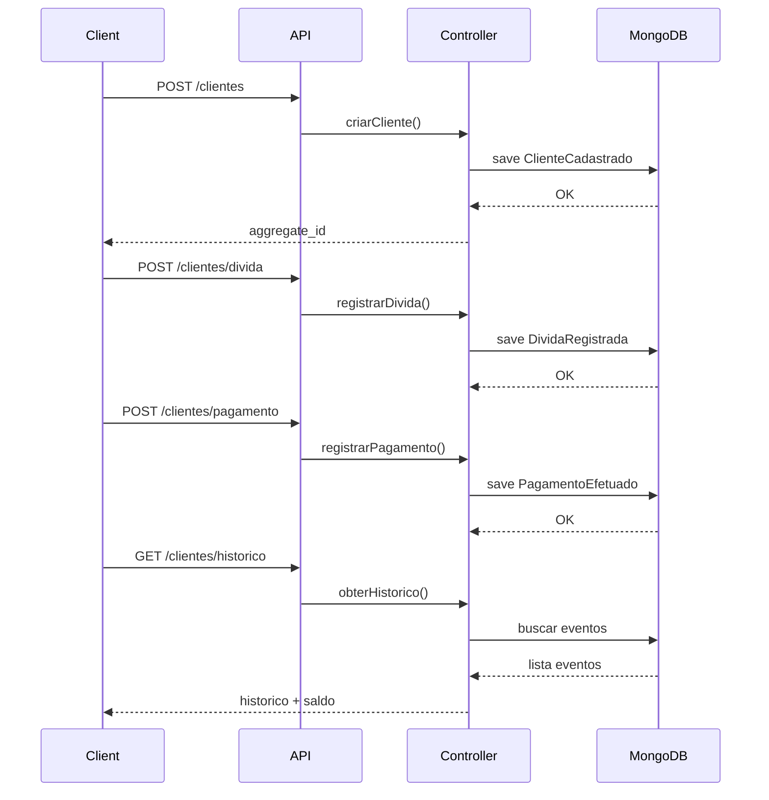

Abaixo está um **README completo em texto** para o seu projeto.
Ele explica **arquitetura, fluxo, decisões técnicas e funcionamento interno**.
Você pode **copiar direto para o GitHub ou enviar para outras LLMs**.

---

# Bar da Filó — API de Controle de Fiado (Event Sourcing + DDD)

## Visão Geral

Este projeto é uma **API REST desenvolvida em Node.js com TypeScript** para gerenciar clientes e seus históricos de dívidas e pagamentos em um sistema de **controle de fiado**.

A API foi refatorada para aplicar princípios de:

* **DDD (Domain Driven Design)**
* **SOLID**
* **Clean Code**
* **Event Sourcing**

Ao invés de salvar diretamente o estado atual do cliente (saldo), o sistema **registra eventos de domínio** que representam ações realizadas.

Exemplos de eventos:

* Cliente cadastrado
* Dívida registrada
* Pagamento efetuado

O **estado atual do cliente é reconstruído a partir do histórico de eventos**.

Essa abordagem é uma simplificação do que é utilizado em sistemas críticos como:

* fintechs
* sistemas bancários
* blockchain
* sistemas contábeis

---

# Arquitetura do Projeto

A arquitetura foi reorganizada para separar responsabilidades e aproximar o projeto de uma estrutura DDD.
```
src
│   server.ts
│   
├───application
│   └───useCases
│           CriarCliente.ts
│           ObterHistorico.ts
│           RegistrarDivida.ts
│           RegistrarPagamento.ts
│
├───domain
│   ├───entities
│   │       Cliente.ts
│   │       
│   ├───events
│   │       EventTypes.ts
│   │       
│   └───repositories
│           EventRepository.ts
│
├───infrastructure
│   ├───database
│   │       mongoose.ts
│   │
│   └───repositories
│           MongoEventRepository.ts
│
├───interfaces
│   ├───controllers
│   │       ClienteController.ts
│   │
│   └───routes
│           clientes.ts
│
└───models
        EventModel.ts
```
---

# Camadas do Sistema

## Domain

Contém **regras de negócio puras**.

Não depende de:

* banco de dados
* framework
* express
* mongoose

Aqui ficam:

* Entidades
* Value Objects
* Regras de negócio

Exemplo de entidade:

```
Cliente
```

Responsável por:

* reconstruir estado a partir de eventos
* validar regras de domínio


---

## Application

Contém **casos de uso do sistema**.

Aqui ficam as operações que o sistema oferece:

* registrar dívida
* registrar pagamento
* reconstruir saldo

Essa camada **coordena o domínio**.

---

## Infrastructure

Responsável pela **integração com tecnologias externas**.

Exemplos:

* MongoDB
* Mongoose
* armazenamento de eventos

---

## Interfaces

Camada responsável pela **comunicação com o mundo externo**.

Aqui ficam:

* Controllers
* Rotas
* DTOs

O controller:

* recebe requisições HTTP
* chama o caso de uso
* retorna resposta HTTP

---

# Event Sourcing

O sistema utiliza **Event Sourcing**.

Ao invés de salvar o estado atual, salvamos **eventos de domínio**.

Exemplo:

```
ClienteCadastrado
DividaRegistrada
PagamentoEfetuado
```

Esses eventos são armazenados em uma coleção MongoDB.

Exemplo de documento salvo:

```
{
  aggregate_id: "uuid",
  event_type: "DividaRegistrada",
  event_data: {
     valor: 50
  },
  created_at: Date
}
```

O campo `aggregate_id` identifica o cliente.

---

# Reconstrução do Estado

Para saber o saldo do cliente, o sistema:

1 busca todos os eventos do cliente
2 ordena cronologicamente
3 aplica cada evento na entidade

Exemplo:

```
ClienteCadastrado
DividaRegistrada 50
DividaRegistrada 30
PagamentoEfetuado 20
```

Reconstrução:

```
saldo = 0

divida 50 → saldo = 50
divida 30 → saldo = 80
pagamento 20 → saldo = 60
```

Saldo atual:

```
60
```

---

# Modelo de Evento

Todos os eventos seguem o mesmo formato.

```
Event
```

Campos:

```
aggregate_id
event_type
event_data
created_at
```

### aggregate_id

Identifica o **aggregate (cliente)**.

UUID.

---

### event_type

Tipo do evento.

Exemplos:

```
ClienteCadastrado
DividaRegistrada
PagamentoEfetuado
```

---

### event_data

Dados específicos do evento.

Exemplo:

```
{
   valor: 50
}
```

ou

```
{
   nome: "Gabriel"
}
```

---

### created_at

Timestamp do evento.

---

# Fluxo do Sistema



## 1 Criar Cliente

Endpoint:

```
POST /clientes
```

Body:

```
{
  nome
  sobrenome
  telefone
  cpf
  email
}
```

Fluxo interno:

```
Controller
 → gera UUID
 → cria evento ClienteCadastrado
 → salva no banco
 → retorna aggregate_id
```

Evento criado:

```
ClienteCadastrado
```

---

## 2 Localizar Cliente

Endpoint:

```
GET /clientes/localizar
```

Query params:

```
nome
cpf
```

Fluxo:

```
controller
 → consulta eventos ClienteCadastrado
 → aplica filtro
 → retorna resultados
```

---

## 3 Registrar Dívida

Endpoint:

```
POST /clientes/divida
```

Body:

```
{
  aggregate_id
  valor
}
```

Fluxo:

```
controller
 → cria evento DividaRegistrada
 → salva no banco
```

---

## 4 Registrar Pagamento

Endpoint:

```
POST /clientes/pagamento
```

Body:

```
{
  aggregate_id
  valor
}
```

Fluxo:

```
controller
 → cria evento PagamentoEfetuado
 → salva no banco
```

---

## 5 Consultar Histórico

Endpoint:

```
GET /clientes/historico
```

Query:

```
aggregate_id
```

Fluxo:

```
controller
 → busca eventos do cliente
 → ordena por data
 → calcula saldo
 → retorna histórico + saldo
```

Resposta:

```
{
  historico: [eventos],
  saldo: number
}
```

---

# Banco de Dados

Banco utilizado:

```
MongoDB
```

Coleção principal:

```
events
```

Cada documento representa **um evento de domínio**.

Não existe tabela de cliente tradicional.

Clientes são reconstruídos a partir dos eventos.

---

# Tecnologias Utilizadas

* Node.js
* Express
* TypeScript
* MongoDB
* Mongoose
* UUID
* dotenv

---

# Vantagens da Arquitetura

### Auditoria completa

Todo histórico é preservado.

Exemplo:

```
quem pagou
quando pagou
quanto pagou
```

---

### Debug fácil

É possível reconstruir qualquer estado do sistema.

---

### Escalabilidade

Eventos são facilmente distribuídos.

---

# Melhorias Futuras

Algumas melhorias planejadas:

### Snapshot

Evitar recalcular todos os eventos.

Salvar estado intermediário.

---

### Enum para tipos de evento

Evitar erros de string.

```
enum EventType
```

---

### Validação de dados

Utilizar:

```
Zod
ou
Joi
```

---

### Middleware global de erro

Centralizar tratamento de exceções.

---

### DTOs tipados

Garantir tipagem forte no TypeScript.

---

# Conclusão

Este projeto demonstra a implementação de:

* Event Sourcing
* Arquitetura em camadas
* DDD
* API REST
* Node.js com TypeScript

Mesmo sendo um sistema simples de controle de fiado, ele foi estruturado utilizando conceitos arquiteturais aplicados em **sistemas financeiros reais**.

A arquitetura permite:

* rastreabilidade completa
* evolução segura
* manutenção facilitada

---

Se quiser, posso também montar uma **versão ainda mais forte para GitHub (com diagramas de arquitetura e fluxo de eventos)** que deixa o projeto **muito mais profissional para portfólio**.
